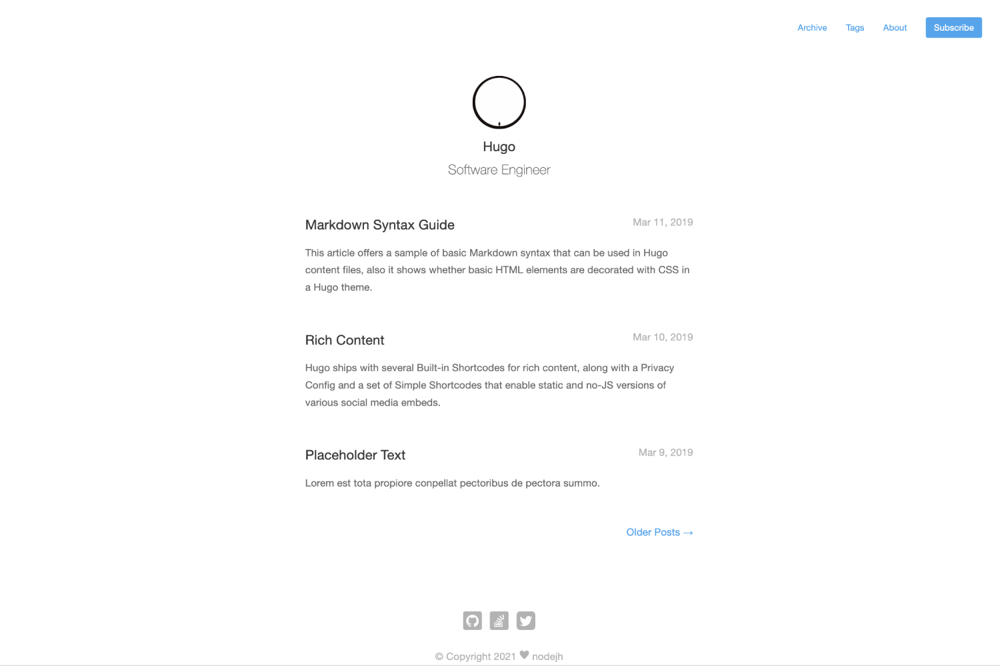

# Hugo Theme Mini

A fast, minimalist and responsive hugo theme.




- [Online demo](https://nodejh.github.io/hugo-theme-mini)
- [Example Site Source](https://github.com/nodejh/hugo-theme-mini/tree/master/exampleSite)

Features:

- Fast
- Minimalist
- Responsive
- Archive
- Tags


## Installation


### As a Hugo Module (recommended)

> ⚠️ If you installed a [Hugo binary](https://gohugo.io/getting-started/installing/#binary-cross-platform), you may not have Go installed on your machine. To check if Go is installed:
> ```
> $ go version
> ```
>  Go modules were considered production ready in v1.14. [Download Go](https://golang.org/dl/). 

1. From your project's root directory, initiate the hugo module system if you haven't already:

    ```bash
    $ hugo mod init github.com/<your_user>/<your_project>
    ```

2. Add the theme's repo to your `config.yaml`:

    ```yaml
    theme: 
       - github.com/nodejh/hugo-theme-mini
    ```

### As Git Submodule

1. Inside the folder of your Hugo site run:

  ```bash
  $ git submodule add https://github.com/nodejh/hugo-theme-mini.git themes/mini
  ```

2. Add the theme's directory to your `config.yaml`:

    ```yaml
   theme: mini
    ```

For more information read the official [setup guide](//gohugo.io/overview/installing/) of Hugo.


## Getting started

After installing the theme successfully it requires a just a few more steps to get your site running.


### The config file

Take a look inside the [`exampleSite`](https://github.com/nodejh/hugo-theme-mini/tree/master/exampleSite) folder of this theme. You'll find a file called [`config.yaml`](https://github.com/nodejh/hugo-theme-mini/blob/master/exampleSite/config.yaml). To use it, copy the [`config.yaml`](https://github.com/nodejh/hugo-theme-mini/blob/master/exampleSite/config.yaml) in the root folder of your Hugo site. Feel free to change the strings in this theme.

> ⚠️ You may need to delete the line: `themesDir: ../../` 

### Add Comments

To enable comments, add following to your config file:

- DISQUS: `disqusShortname: your-disqus-shorname`
- Enable Comment:

    ```yaml
    params:
      enableComments: true
    ```

### Google Analytics

To enable google analytics, add following to your config file:

- DISQUS: `googleAnalytics: your-google-analytics-id`
- Enable Comment:

    ```yaml
    params:
      enableGoogleAnalytics: true
    ```

### Logo and favicon

You can replace the log in the top of each page and favicon with your own images. To do that put your own logo and favicon into the `images` directory of your website static directory, then named them `avatar.png` and `favicon.ico`. For example:

```
- content
- static
└── images
    ├── avatar.png
    └── favicon.ico
```

### Nearly finished

In order to see your site in action, run Hugo's built-in local server.

```bash
$ hugo server
```

Now enter localhost:1313 in the address bar of your browser.

## License

[MIT](https://github.com/nodejh/hugo-theme-mini/blob/master/LICENSE.md)